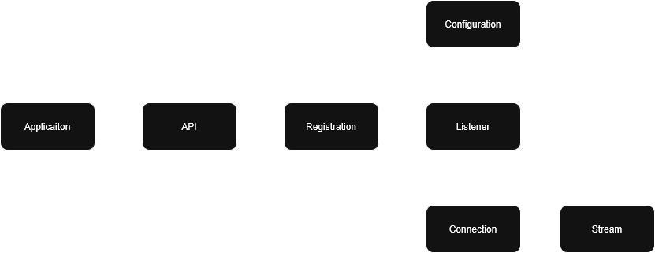

# TCP-to-QUIC-portability library

General purpose library for porting TCP applications to QUIC using Microsoft's
MsQUIC library.

## Description

The goal of this library is to assist in porting TCP applications to QUIC. It
accomplishes this by creating alternate versions of standard linux networking
system calls
- socket()
- bind()
- listen()
- connect()
- accept()
- write()
- send()
- read()
- close()

These can then be accessed by loading the shared library, allowing the
application to run as normal while using QUIC transport instead of TCP. From the
point of view of the application nothing changes, and upper layer processing is
handled as normal. This library is intended as a way to create proof-of-concept
to get TCP applications to run using QUIC with as few modifications as possible
to application itself.

## Architecture

The library works by mapping system calls onto the API exposed by the MsQUIC
library. The biggest challenge in this mapping is the fact that the MsQUIC
execution model differs a lot from standard BSD-style sockets. MsQUIC utilizes
asynchronous event handling for processing of events, as compare to standard
networking function where the application must make a system call to check if
something has happened. This also means that sockets are not directly exposed
to the application when using MsQUIC.

The high level model of the MsQUIC API is constructed as following

### Mapping of networking function onto MsQUIC API

@TODO Add flowchart

#### socket()
1. Initialize MsQUIC API, Registration and Configuration
2. Create a phony file descriptor to be used at a later stage and return it as the socket file descriptor

#### bind()
1. Add server certificates to MsQUIC Configuration and load the Configuration
2. Create a MsQuic Listener and store a reference to it indexing it by using the file descriptor set up by Socket(). Stores a callback handler specific to server processing
3. Store the socket address and port for later use

#### listen()
1. Set the address stored by bind on the MsQUIC Listener created by bind
2. Start the Listener

#### connect()

1. Setup and load MsQUIC configuration for client
2. Create and start a MsQUIC Connection
3. Create and start a MsQUIC bidirectional stream

#### accept()

1. Loop to simulate blocking until a Connection is created by client and registered via listener event handler
2. Return a phony file descriptor that refers to the MsQUIC Connection/Stream

#### write()

1. Use StreamSend() to write data to the stream index by file descriptor from connect/accept 

#### send()

1. Uses write() call for processing, flags are ignored

#### read()
1. Loop until MsQUIC stream callback writes some data to the read buffer, then return this data

#### close()
1. Check for MsQUIC objects indexed by file descriptor
2. Close them in the appropriate order

## Restrictions
- Only a single client at a time
    - Only one Listener per Registration
    - Only one Connection per Listener
    - Only one Stream per Connection
        - If multiple clients try to connect/open streams simultaneously then only the latest will be stored, as there is no way to pass the events to the application from transport

## Getting started

### Dependencies

### Running the example application

## Author

David Enberg -  davenberg00@gmail.com